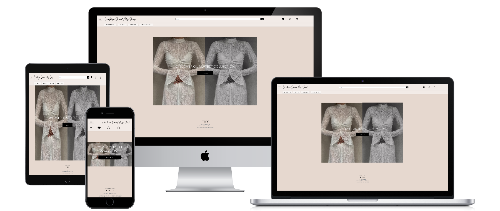

# VintageSavedMySoul



<div align="center">

Explore [VintageSavedMySoul](https://vintagesavedmysoul-eb73f1fba3d0.herokuapp.com/)

</div> <div align="center">

</div>

----------

## 🏺 Introduction


Welcome to **VintageSavedMySoul**, your go-to destination for carefully hand-picked vintage-style pieces and handmade items. By choosing secondhand and handmade, you’re celebrating sustainable fashion and reducing the negative impact of fast fashion on our planet.

### Objectives

-   **Promote Sustainability**: Encourage consumers to choose secondhand clothes and handcrafted items to foster a more eco-conscious lifestyle.
-   **Enhance User Experience**: Deliver a visually cohesive, intuitive, and user-friendly platform that helps customers browse and purchase items effortlessly.
-   **Establish Brand Authenticity**: Curate a wide range of unique, timeless pieces while sharing the story behind each vintage treasure.
-   **Grow a Conscious Community**: Cultivate a community passionate about vintage style, ethical consumption, and mindful living.

### Target Audience

-   **Vintage Fashion Enthusiasts**: Passionate about discovering one-of-a-kind garments and accessories with nostalgic charm.
-   **Eco-Conscious Shoppers**: Eager to reduce their carbon footprint by prioritizing secondhand and handmade goods.
-   **Handmade Artisans**: Those looking to support or purchase carefully crafted, small-batch items made with love.
-   **Gift Shoppers**: Individuals hoping to find thoughtful, unique gifts that can’t be found in typical high street stores.

### Problem Being Solved

-   **Reducing Fast Fashion Impact**: Offering curated, preloved vintage items to combat wasteful consumption patterns.
-   **Exclusive Finds**: Providing shoppers with items that are not mass-produced, helping them stand out and express personal style.
-   **Streamlined Shopping**: A user-friendly online platform bridging the gap between vintage enthusiasts and high-quality secondhand/handmade pieces.

### Scope

VintageSavedMySoul aims to create an inclusive experience for vintage and handmade enthusiasts worldwide. The platform includes:

-   **Robust Catalog**: Showcasing secondhand clothing, handmade treasures, and more.
-   **Filtering System**: Quickly refine searches by style, era, color, size, price range, and more.
-   **User Accounts**: Manage favorites, track orders, and review items.
-   **Admin CMS**: For efficient management of product listings, user accounts, stock, and shipping details.
-   **Global Shipping**: Making preloved fashion accessible to customers around the world.

<br>

## 📜 Table of Contents

1.  [Introduction](#introduction)
    -   [Objectives](#objectives)
    -   [Target Audience](#target-audience)
    -   [Problem Being Solved](#problem-being-solved)
    -   [Scope](#scope)
2.  [📈 Business and Marketing Plan](#-business-and-marketing-plan)
    -   [Introduction](#introduction-1)
    -   [Target Market](#target-market)
    -   [Revenue Model](#revenue-model)
    -   [Marketing Strategies](#marketing-strategies)
    -   [Key Performance Indicators (KPIs)](#key-performance-indicators-kpis)
    -   [Risks and Mitigation Strategies](#risks-and-mitigation-strategies)
3.  [🧑‍💻 Development Plan](#-development-plan)
    -   [Introduction](#introduction-2)
    -   [Research and Initial Decisions](#research-and-initial-decisions)
    -   [Point System and Estimation](#point-system-and-estimation)
    -   [Timeline and Milestones](#timeline-and-milestones)
    -   [Methodologies](#methodologies)
4.  [🖌️ UX/UI Design Plan](#%EF%B8%8F-uxui-design-plan)
    -   [The Strategy Plane](#the-strategy-plane)
    -   [The Scope Plane](#the-scope-plane)
    -   [The Structure Plane](#the-structure-plane)
    -   [The Skeleton Plane](#the-skeleton-plane)
    -   [The Surface Plane](#the-surface-plane)
5.  [⭐ Features](#-features)
6.  [🌠 Future Enhancements](#-future-enhancements)
7.  [🧮 Testing](#-testing)
8.  [🤖 Technologies Used](#-technologies-used)
9.  [⚙️ Setup and Installation (GitHub and Heroku)](#%EF%B8%8F-setup-and-installation-github-and-heroku)
10.  [🎓 Credits & Acknowledgements](#-credits--acknowledgements)


----------

# 📈 Business and Marketing Plan

### Introduction

VintageSavedMySoul is a **B2C e-commerce** platform dedicated to vintage and handmade items. This plan outlines strategies to position our brand as a top choice among ethical shoppers who appreciate one-of-a-kind finds.

### Target Market

-   **Fashion-Forward Individuals** seeking rare, style-defining pieces not found in mainstream stores.
-   **Environmentally Conscious Buyers** preferring preloved items to reduce textile waste.
-   **Collectors and Creatives** searching for timeless garments, accessories, and décor reflecting historical and artisanal values.

### Revenue Model

1.  **Direct Sales**: Each preloved or handmade piece is sold directly to consumers.
2.  **Feature Listings**: Artisans or sellers can pay to have specific items featured.
3.  **Add-on Services**: Potential add-ons include custom fitting or small alterations.

### Marketing Strategies

**Online Marketing**

1.  **SEO**: Targeted keywords like “vintage fashion,” “handmade clothing,” and “preloved items” to rank higher on search engines.
2.  **Social Media**: Focus on Instagram for visually engaging vintage content, plus Facebook for community building.
3.  **Influencer Collaborations**: Work with vintage stylists, local artisans, and sustainable living influencers.

**Offline Marketing**

1.  **Local Vintage Fairs**: Showcase curated items at fairs to engage face-to-face with potential customers.
2.  **Community Partnerships**: Team up with local thrift shops or charities for donation-based drives or pop-up events.

### Key Performance Indicators (KPIs)

1.  **Conversion Rate**: From site visits to completed purchases.
2.  **Repeat Customers**: Track how many buyers return for more items.
3.  **Average Order Value (AOV)**: Monitor the average spend per transaction.

### Risks and Mitigation Strategies

1.  **Inventory Fluctuation**: Vintage items are often one-of-a-kind, so supply can be inconsistent. Mitigate by balancing preloved stock with newly handmade pieces.
2.  **Competitive Market**: Offer a strong brand identity, excellent curation, and personal storytelling for each piece to stand out.


<br>

[⬆️Back to top](#-table-of-contents)

----------

# 🧑‍💻 Development Plan

### Introduction

The development of VintageSavedMySoul followed an **Agile** methodology, ensuring iterative improvements, user feedback incorporation, and flexible pivoting to enhance the final product’s quality and usability.

### Research and Initial Decisions

-   **Competitive Analysis**: Explored popular vintage marketplaces (e.g., Etsy,Zara,Mango) for best practices in listing style, filtering, and user review systems.
-   **Technology Stack**: Decided on Django (Python) for robust e-commerce features, and used framework like Bootstrap for an enhanced front-end.
-   **Data Structures**: Key models designed to handle inventory, orders, user profiles, and favorite items.

### Methodologies

-   **Agile / Scrum**: I tried but i understand that i need to revise and understand better what are best practices
-   **GitHub Projects**: Kanban board for tracking user stories and tasks.
-   **Continuous Integration**: Automatic checks for linting, testing, and build deployments.


[⬆️Back to top](#-table-of-contents)

----------

# 🖌️ UX/UI Design Plan

### The Strategy Plane

**Site’s Ideal User**: Individuals browsing for curated vintage items or unique handmade pieces who value authenticity, sustainability, and style.

**Site Goals**:

-   Showcase curated stock with appealing visuals.
-   Provide seamless shopping and checkout experiences.
-   Convey a brand ethos of eco-conscious living and mindful consumption.

### The Scope Plane

**Functionalities**:

-   Browsable catalog with filtering (size, style, ).
-   Shopping cart with quantity adjustments.
-   Order checkout with secure payment integration.
-   Favorite items for quick access.


### The Structure Plane

-   **Navigation**: Straightforward top navbar with All Products, Vintage, Handmade, Special Offers,cart icon, user login, and favorites are easily accessible.
-   **Information Architecture**:
    -   Home → Home Page,Navbar with featured categories.
    -   Shop → All Categories, filter sidebar/drawer with About Page.
    -   Product Detail Page → Photos, detailed description, “add to cart”, “add to favorites”
    -   Checkout → Payment info, shipping details sent to email later, order summary.
-   **Filtering & Sorting**: By category,All, price range or Name.

### The Skeleton Plane

**Wireframes**:
<details><summary><b>Homepage</b></summary>


</details>
<br>
<details><summary><b>Homepage-Menu</b></summary>


</details>
<br>
<details><summary><b>Mobile_Home</b></summary>


</details>
<br>
<details><summary><b>Products_Page</b></summary>


</details>
<br>
<details><summary><b>Product_Detail_Page</b></summary>


</details>
<br>

**Database Schema**:
<br>  
Use an **ER diagram** with tables for `User`, `Product`, `Category`, `Order`, `OrderLineItem`, and a pivot table for `favorited_by`.


### The Surface Plane

**Design**:

-   Clean, vintage-inspired aesthetic. Neutral backgrounds with accent colors for buttons.

<br>
-   Typography:

<br>
-   High-quality product images to highlight item details.
<br>


[⬆️Back to top](#-table-of-contents)

----------

# ⭐ Features

1.  **Home Page**
    
    -   Minimalist hero banner emphasizing brand ethos: “Shop secondhand, save the planet.”
    -   Quick links to popular categories or new arrivals.
2.  **Product Catalog**
    
    -   Dynamic filter drawer (for mobile) or sidebar (for desktop).
    -   Real-time updates on category, size, color filters.
    -   “Add to Favorites” heart icon for logged-in users.
3.  **Product Detail Page**
    
    -   Multiple images, item condition note, small description, measurements, price, stock count.
    -   “Add to Cart” or “Notify me” if out of stock.
4.  **Cart & Checkout**
    
    -   Cart summary with quantity adjustments, total cost update.
    -   Secure checkout with form validations, integrated with a payment gateway like Stripe/PayPal.
    -   Order confirmation email.
5.  **User Profiles**
    
    -   Track past orders, manage shipping addresses, wishlist/favorites, optional reviews.
6.  **Favorites**
    
    -   Track wishlist/favorites. 
7.  **Admin Panel**
    
    -   Manage products, categories, and user data.
    -   Stock updates and advanced shipping rules.

8.  **Admin Panel** 🛑 Custom Error Handler (404)

- **Styled Design**: The 404 error page is designed to fit the overall website's theme, making it less disruptive for users who land on it.

- **User Guidance**: Offers options to return to the homepage or navigate to other sections of the site.

<b>Custom 404 Handler</b>


### Additional/Optional Features

-   **Reviews & Ratings**: Provide social proof and feedback for each item.
-   **Newsletter Subscription**: Encourage email signups for new arrivals, promos.
-   **Customizable Gift Packaging**: Let customers add special notes or gift-wrapping for loved ones.

[⬆️Back to top](#-table-of-contents)

----------

# 🌠 Future Enhancements
-   **Fix Responsiveness & its Layout Desing**: In time frame i didnt manage ti fix the responsivess iregularities.
-   **Social Sign-In**: Quick registration via Google, Facebook, or Instagram.
-   **Loyalty Program**: Reward system for repeat purchases, small discounts, or free shipping.
-   **Live Chat**: 24/7 customer support or AI chatbot for instant queries.
-   **Vendor Portal**: For local artisans to list their handmade items on the platform.
-   **Multi-language & Currency**: Serve a global audience with automatic currency conversion and language toggles.

----------

# 🧮 Testing

For detailed testing procedures (browser compatibility, device responsiveness, user scenario checks, code validation, etc.), refer to the dedicated **Testing Documentation**:

> [View Full Testing Docs](github_assets/docs/TESTING.md)  


----------

# 🤖 Technologies Used

-   **Front-End**: HTML5, CSS Bootstrap, JavaScript.
-   **Back-End**: Python, Django
-   **Database**: PostgreSQL (via ElephantSQL or Heroku Postgres).
-   **Deployment**: Heroku for hosting, AWS S3 for static and media files.
-   **Version Control**: Git & GitHub.
-   **Design**:Figma for graphics and wireframes.


### Other Tools
- **Git**: The version control system used to manage the code.  
  [Official Git Website](https://git-scm.com/)
- **Pip3**: The package manager used to install dependencies.  
  [Pip3 Documentation](https://pip.pypa.io/en/stable/)
- **Django-allauth**: The authentication library used to create user accounts.  
  [Django-allauth Docs](https://django-allauth.readthedocs.io/)
- **Django-crispy-forms**: Used to control the rendering behavior of Django forms.  
  [Django-crispy-forms Docs](https://django-crispy-forms.readthedocs.io/)
- **GitHub**: Used to host the website's source code.  
  [Official GitHub Website](https://github.com/)
- **Chrome DevTools**: Used to debug the website.  
  [Chrome DevTools Docs](https://developer.chrome.com/docs/devtools/)
- **Font Awesome**: Used to create the icons used on the website.  
  [Official Font Awesome Website](https://fontawesome.com/)
- **W3C Validator**: Used to validate HTML5 code for the website.  
  [W3C HTML Validator](https://validator.w3.org/)
- **W3C CSS Validator**: Used to validate CSS code for the website.  
  [W3C CSS Validator](https://jigsaw.w3.org/css-validator/)
- **JShint**: Used to validate JS code for the website.  
  [Official JShint Website](https://jshint.com/)
- **PEP8**: Used to validate Python code for the website.  
  [PEP8 Docs](https://pep8.org/)
- **Stripe**: Used to create the payment system.  
  [Official Stripe Website](https://stripe.com/)
- **Sitemap Generator**: Used to create the `sitemap.xml` file.  
  [XML Sitemap Generator](https://www.xml-sitemaps.com/)
- **Django-extensions**: Used to create an Entity-Relationship Diagram.  
  [Django-extensions Docs](https://django-extensions.readthedocs.io/)

---
## Dependencies

To run this project, you need to install the following dependencies. You can do this by running `pip install -r requirements.txt` in your command line. Ensure you are in the project's root directory where the `requirements.txt` file is located.
```
argcomplete==3.3.0
asgiref==3.8.1
beautifulsoup4==4.12.3
boto3==1.35.29
botocore==1.35.29
cffi==1.16.0
charset-normalizer==3.3.2
click==8.1.7
cryptography==41.0.7
dj-database-url==0.5.0
Django==5.1.1
django-allauth==64.2.1
django-countries==7.6.1
django-crispy-forms==1.14.0
gunicorn==23.0.0
humanize==3.13.1
idna==3.7
iso639==0.1.4
jmespath==1.0.1
lxml==5.1.0
Mako==1.2.3
MarkupSafe==2.1.3
pexpect==4.9.0
pid==2.2.3
pillow==10.4.0
pillow-avif-plugin==1.4.6
ply==3.11
psycopg2==2.9.9
ptyprocess==0.7.0
pycairo==1.25.1
pycparser==2.20
python-dateutil==2.8.2
python-decouple==3.8
pytz==2024.1
regex==2024.4.28
requests==2.31.0
sqlparse==0.5.1
stripe==11.0.0
typing_extensions==4.12.2
urllib3==1.26.20
wheel==0.44.0
django-environ==0.11.2
crispy-bootstrap4
whitenoise==6.7.0
cloudinary
django-cloudinary-storage
``` 


### ⚙️ Deployment to heroku & GitHub

**In your app** 

1. add the list of requirements by writing in the terminal "pip3 freeze --local > requirements.txt"
2. Git add and git commit the changes made

**Log into heroku**

3. Log into [Heroku](https://dashboard.heroku.com/apps) or create a new account and log in

4. top right-hand corner click "New" and choose the option Create new app, if you are a new user, the "Create new app" button will appear in the middle of the screen

5. Write app name - it has to be unique, it cannot be the same as this app
6. Choose Region - I am in Europe
7. Click "Create App"

**The page of your project opens.**

8. Go to Resources Tab, Add-ons, search and add Heroku Postgres

9. Choose "settings" from the menu on the top of the page

10. Go to section "Config Vars" and click button "Reveal Config Vars". 

11. Add the below variables to the list

    * Database URL will be added automaticaly
    * Secret_key - is the djnago secret key can be generated [here](https://miniwebtool.com/django-secret-key-generator/). 
    * Cloudinary URL can be obtained from [cloudinary](https://cloudinary.com/) follow the steps on the website to register. 

**Go back to your code**

12. Procfile needs to be created in your app
```
web: gunicorn PROJ_NAME.wsgi
```

13. In settings in your app add Heroku to ALLOWED_HOSTS

14. Add and commit the changes in your code and push to github

**Final step - deployment**

15. Next go to "Deploy" in the menu bar on the top 

16. Go to section "deployment method", choose "GitHub"

17. New section will appear "Connect to GitHub" - Search for the repository to connect to

18. type the name of your repository and click "search"

19. once Heroku finds your repository - click "connect"

20. Scroll down to the section "Automatic Deploys"

21. Click "Enable automatic deploys" or choose "Deploy branch" and manually deploy

22. Click "Deploy branch"

Once the program runs:
you should see the message "the app was sussesfully deployed"

23. Click the button "View"

The live link can be found [here](https://tank.up.railway.app/), but currently deployed to Railway - as described below. 

### Deployment to Railway app

Due to heroku starting to charge for deploying full stack application I moved my app to [railway app](https://railway.app/)
I needed to change the way env variables are refered in settings.py

Needed to add runtime.txt that was stating what version of python the app runs.

I copied env variables to heroku and deployed on Railway appp

### Forking the GitHub Repository

By forking the GitHub Repository you will be able to make a copy of the original repository on your own GitHub account allowing you to view and/or make changes without affecting the original repository by using the following steps:

1. Log in to GitHub and locate the [GitHub Repository](https://github.com/YakivBrychuk/VintageSavedMySoul/tree/main)
2. At the top of the Repository (not top of page) just above the "Settings" button on the menu, locate the "Fork" button.
3. You should now have a copy of the original repository in your GitHub account.

### Making a Local Clone

1. Log in to GitHub and locate the [GitHub Repository](https://github.com/YakivBrychuk/VintageSavedMySoul/tree/main)
2. Under the repository name, click "Clone or download".
3. To clone the repository using HTTPS, under "Clone with HTTPS", copy the link.
4. Open commandline interface on your computer
5. Change the current working directory to the location where you want the cloned directory to be made.
6. Type `git clone`, and then paste the URL you copied in Step 3.

```
$ git clone https://github.com/YakivBrychuk/VintageSavedMySoul
```

7. Press Enter. Your local clone will be created.

### Setting up your local enviroment

1. Create Virtual enviroment on your computer or use gitpod built in virtual enviroment feature.

2. Create .env file. Place in inside mileage_tracker folder. It needs to contain those 4 variables.

* Database URL can be obtained from [railway app](https://railway.app/), add PostgreSQL as an add on when creating an app. 
* Secret_key - is the djnago secret key can be generated [here](https://miniwebtool.com/django-secret-key-generator/). 


```
DATABASE_URL = ...
SECRET_KEY = ...
CLOUDINARY_URL = ...
DEVELOPMENT = True
```

3. Run command 
```
pip3 install -r requirements.txt
```


## Learning Resources
- **Corey Schafer on YouTube**: Special thanks to [Corey Schafer](https://www.youtube.com/@coreyms) for his excellent tutorials on Django. His content was instrumental in helping me understand and effectively implement HTMX in the project.
- **General Online Resources**:
  - **Stack Overflow**: For being an invaluable resource in troubleshooting and solving numerous coding challenges.
  - **Google**: For serving as the gateway to a wealth of information, tips, and solutions that were essential throughout the development process.

## Acknowledgements

A heartfelt thank you to the individuals who have provided guidance, support, and inspiration throughout the development of Mont Adventures:

- **Laura Mayock**: Gratitude to [Laura Mayock](https://www.linkedin.com/in/laura-mayock/), for her meaningful conversations and excellent facilitation within our cohort. Your insights and support have been greatly appreciated.

- **My Family**: Immense thanks to my family, who endured my constant screen time over the last three months. Your patience and support have meant the world to me.

- **Code Institute Slack Community**: To the vibrant and humorous Slack community at the Code Institute, thank you for the great laughs and the sense of belonging.

- **Future Assessor**: And to the assessor reviewing this portfolio, I sincerely apologies for not meeting all points of criteries for PP5 and that i cannot share with you whole idea that i envisioned in my head about this project. 

###  Reflection

**Closing Thoughts**: As I look back, I realize that i could do better if i just started doing this project earlier or found dedicated time for this but due to personal ups and downs in life i struglled to to be on track developing this project. But this is not just a project; it's a testament that i should not stop and continue dedicate time in improving, learning more and finish this project.
P.S: This project was invisioned to be MVP Test for Real E-commerce website i want to do for my Girlfriend.